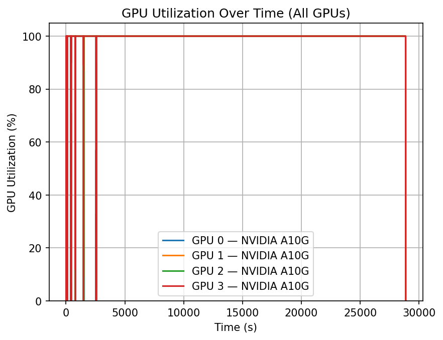
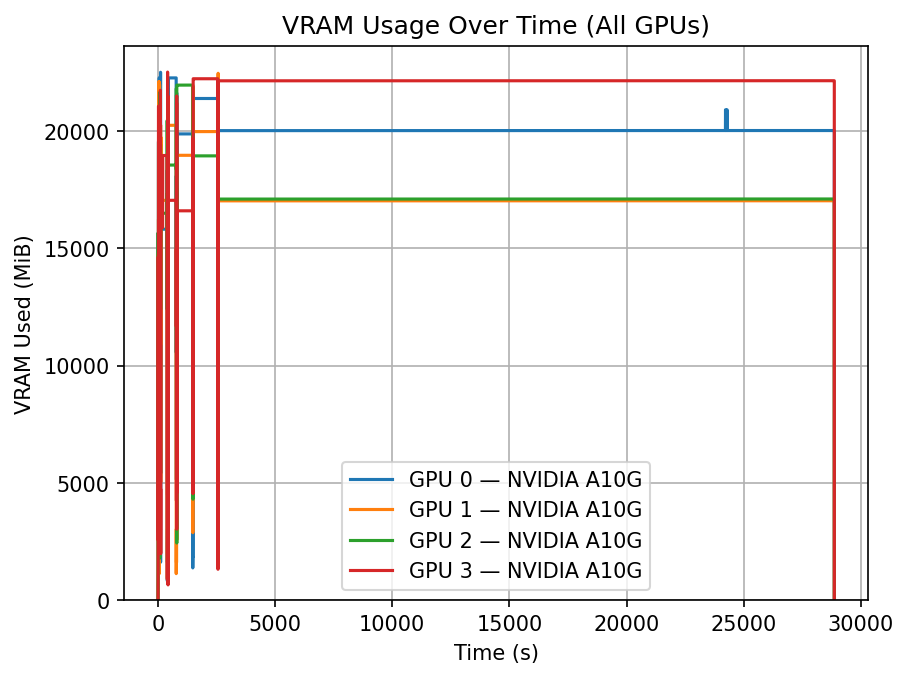
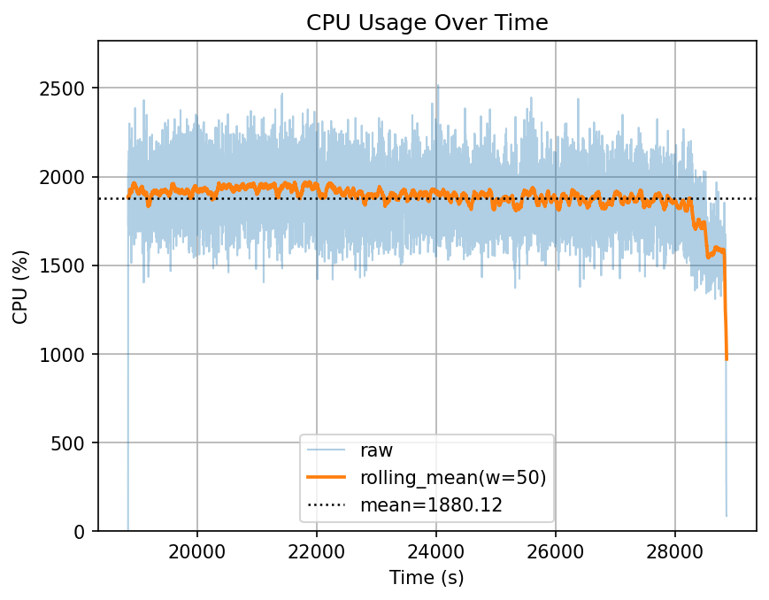
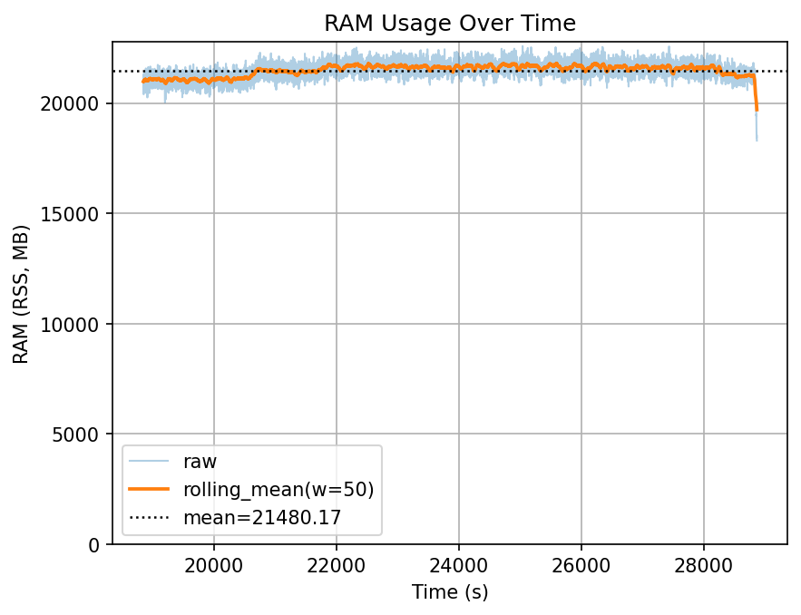
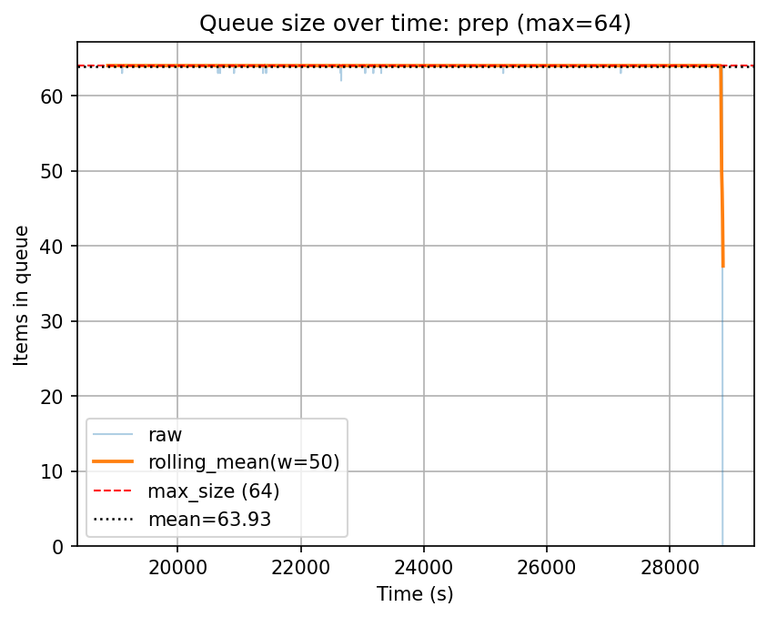
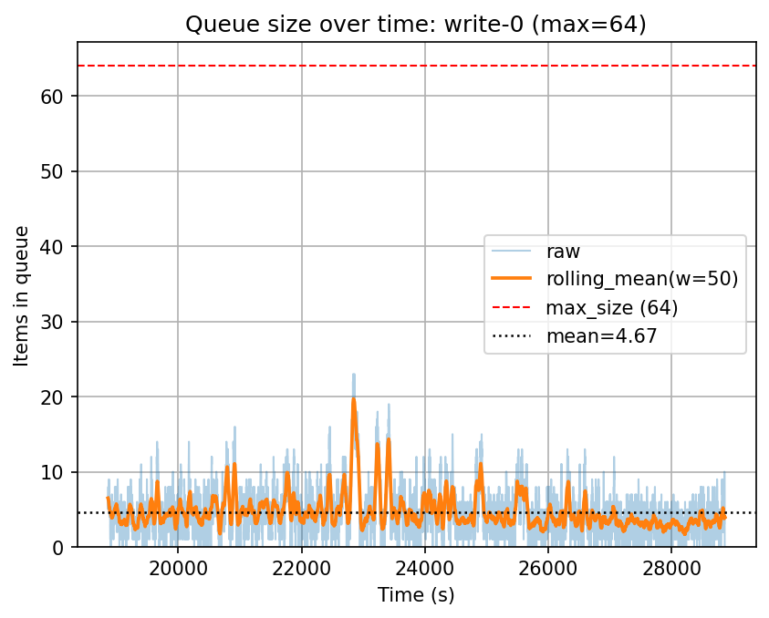
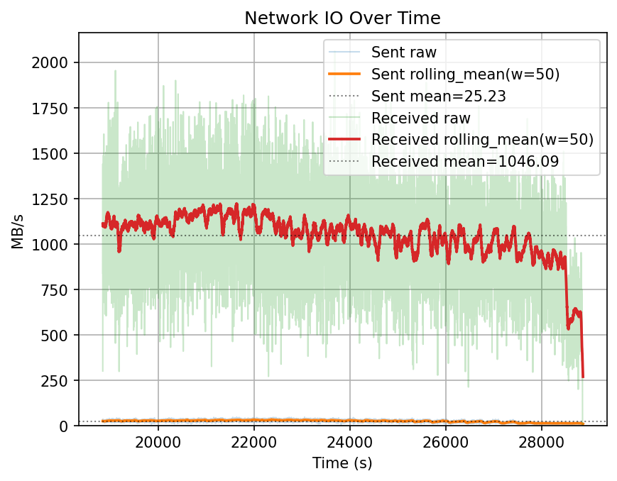
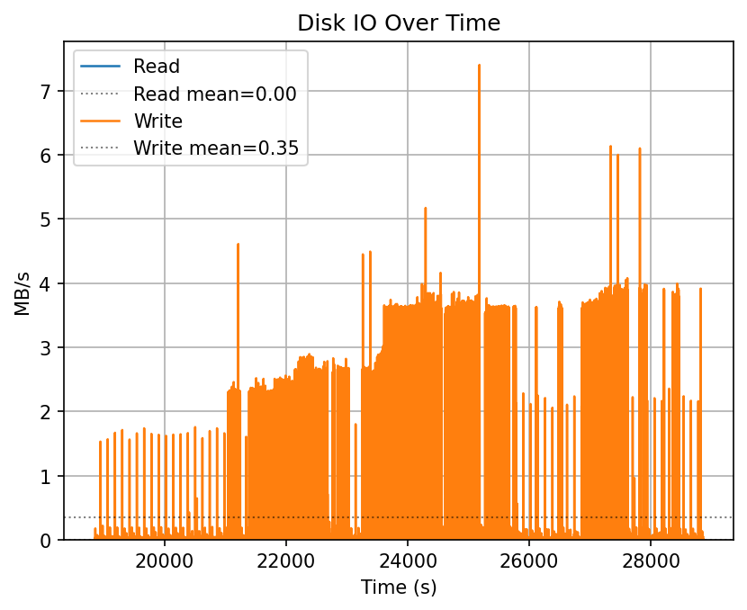

# Benchmarking

This document describes how to reproduce and interpret the benchmarking results (plots) stored in this directory.

## Environment

Benchmarks were run on an **AWS g5.12xlarge** (4 × NVIDIA A10G, 48 vCPU, 192 GB RAM).

### Environment Setup

The following commands reproduce the Python environment used for benchmarking

```bash
conda update conda -y
conda update mamba -y
mamba create -n compression -c conda-forge python=3.11 -y
conda activate compression

git clone https://github.com/AllenNeuralDynamics/aind-torch-utils.git
cd aind-torch-utils
git checkout dev
pip install '.[denoise-net,extras]'
```

## TensorStore Specs Used

Input spec (`data/in_spec.json`):

```json
{
    "driver": "zarr",
    "kvstore": "s3://aind-open-data/exaSPIM_784896_2025-08-19_10-48-12/SPIM.ome.zarr/tile_000010_ch_488.zarr/0",
    "context": {
        "cache_pool": {
            "total_bytes_limit": 4000000000
        },
        "data_copy_concurrency": {
            "limit": 16
        },
        "s3_request_concurrency": {
            "limit": 32
        }
    }
}
```

Output spec (`data/out_spec.json`):

```json
{
    "driver": "zarr2",
    "kvstore": {
        "driver": "s3",
        "bucket": "test-bucket",
        "aws_region": "us-west-2",
        "path": "out.zarr"
    },
    "context": {
        "cache_pool": {
            "total_bytes_limit": 0
        },
        "data_copy_concurrency": {
            "limit": 16
        },
        "s3_request_concurrency": {
            "limit": 32
        }
    },
    "path": "0",
    "recheck_cached_metadata": false,
    "recheck_cached_data": false,
    "metadata": {
        "shape": [1, 1, 20480, 10640, 14192],
        "zarr_format": 2,
        "fill_value": 0,
        "chunks": [1, 1, 256, 256, 256],
        "compressor": {
            "id": "blosc",
            "cname": "zstd",
            "clevel": 5,
            "shuffle": 1
        },
        "dimension_separator": "/",
        "dtype": "<u2"
    },
    "create": true,
    "delete_existing": true
}
```

## Run Command

```bash
python -m aind_torch_utils.run \
  --in-spec /data/in_spec.json \
  --out-spec /data/out_spec.json \
  --model-type denoise-net \
  --weights /root/capsule/scratch/BM4DNet-20250905-169-0.0073.pth \
  --t 0 --c 0 \
  --patch 64 64 64 \
  --overlap 10 \
  --block 256 256 256 \
  --batch 64 \
  --devices cuda:0 cuda:1 cuda:2 cuda:3 \
  --seam-mode trim \
  --trim-voxels 5 \
  --halo 5 \
  --max-inflight-batches 64 \
  --norm-lower 0.5 --norm-upper 99.9 \
  --clip-norm 0.0 5.0 \  # to match Anna's training code for these weights
  --min-blend-weight 0.05 \
  --prep-workers 16 \
  --writer-workers 8 \
  --metrics-json /results/metrics.json \
  --metrics-interval 1
```

GPU metrics collection (run in parallel):

```bash
nvidia-smi --query-gpu=timestamp,index,name,memory.used,utilization.gpu \
  --format=csv -l 1 -f /results/gpu_metrics.csv
```

Plots generated with:

```bash
python benchmarking/plot_metrics.py /results/metrics.json --mean --smooth 50 --out /results/sys_plot
python benchmarking/plot_gpu_metrics.py /results/gpu_metrics.csv --out /results/gpu_plot
```

## Runtime Summary

```
Total time: 28864.12 s
Throughput: 214.28 MB/s
```

## GPU Performance

| GPU Utilization | VRAM Usage |
|-----------------|------------|
|  |  |

## System Metrics

| CPU | RAM |
|-----|-----|
|  |  |

## Queues & Scheduling

| Prep Queue | Writer Queue (example 0) |
|------------|--------------------------|
|  |  |

## I/O (Network & Disk)

| Network IO | Disk IO |
|------------|---------|
|  |  |

